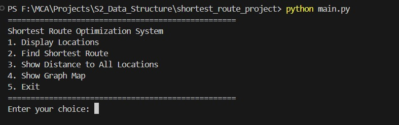
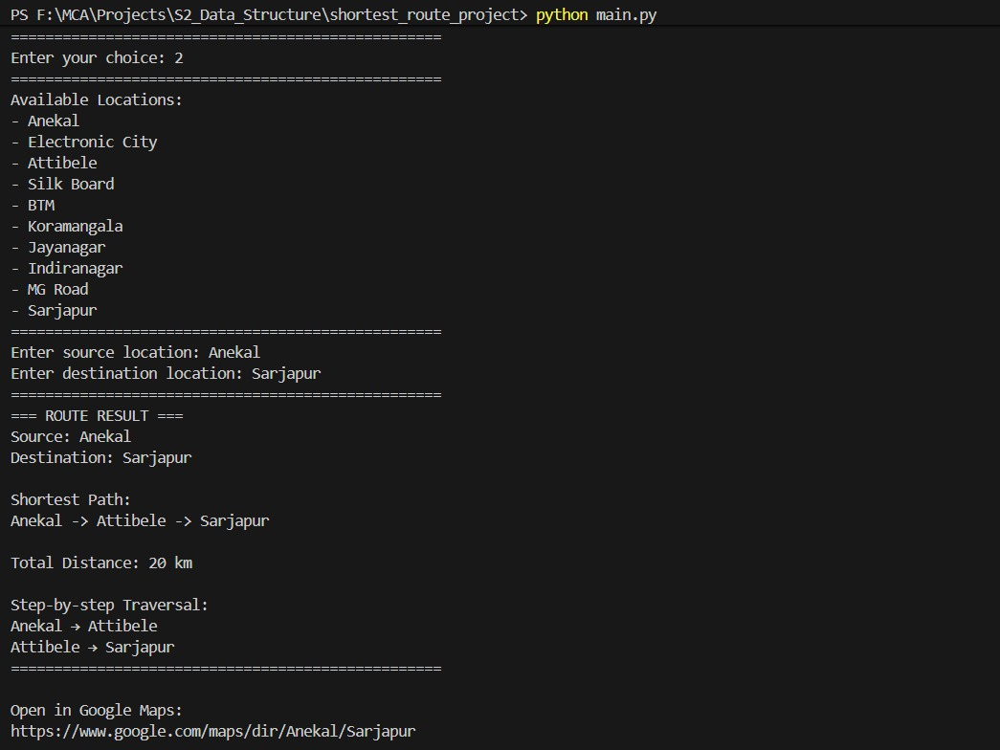
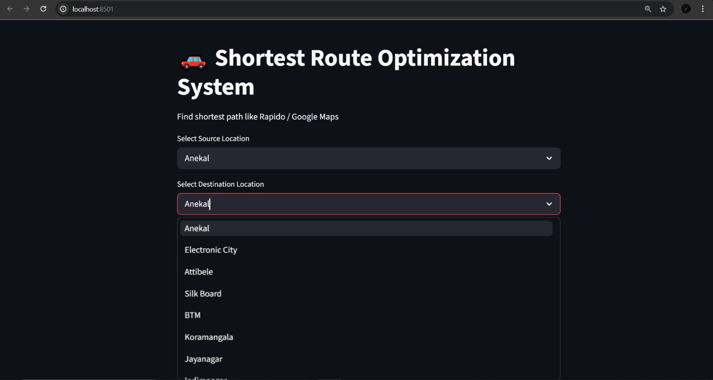
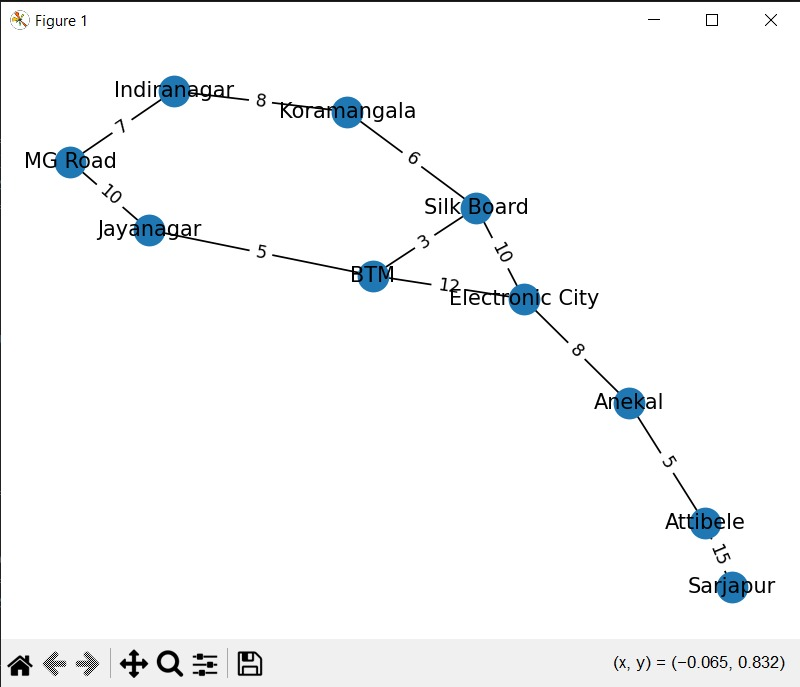
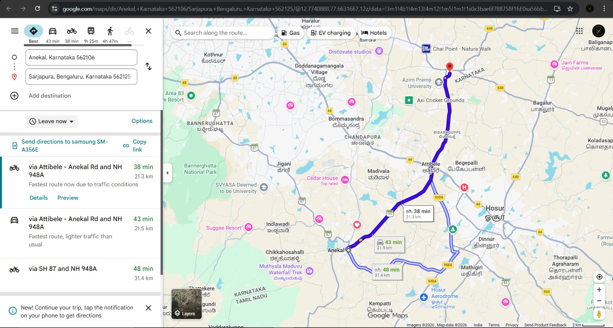

# 🚗 Shortest Route Optimization System
### 📍 Dijkstra’s Algorithm | 🌐 Streamlit Web App | 🗺️ Google Maps Integration

---

## 📌 Project Overview

This project implements a **Shortest Route Optimization System** similar to real-world ride-sharing and navigation platforms like Rapido, Uber, and Google Maps.

The system uses **Dijkstra’s Algorithm** to compute the shortest path between locations represented as a weighted graph. It provides an efficient way to determine optimal routes, minimizing travel distance and improving decision-making.

The project includes both a **console-based system** and a **modern web interface using Streamlit**, along with **graph visualization** and **Google Maps integration** for real-world relevance.

---

## 🚀 Key Features

✔ Shortest path computation using Dijkstra’s Algorithm  
✔ Step-by-step route traversal  
✔ Total distance calculation  
✔ Distance from source to all locations  
✔ Interactive **Streamlit Web Interface**  
✔ Graph visualization using NetworkX  
✔ Google Maps route link generation  
✔ Robust error handling and validation  
✔ Modular and scalable project design  

---

## 🧠 Technologies Used

- Python 3  
- Streamlit  
- NetworkX  
- Matplotlib  
- Heapq (Priority Queue)  

---

## 🏗️ Project Structure
```
shortest_route_project/
│
├── main.py # Console-based interface
├── app.py # Streamlit frontend
│
├── graph_data.py # Graph data (road network)
├── dijkstra_algo.py # Dijkstra algorithm implementation
├── utils.py # Helper functions
│
├── test_cases.py # Testing module
├── visualize_graph.py # Graph visualization
│
├── screenshots/ # Project screenshots
│ ├── console.jpeg
│ ├── console1.jpeg
│ ├── graph.jpeg
│ ├── streamlit.jpeg
│ └── streamlit1.jpeg
│
├── README.md # Documentation
├── report_notes.txt # Report content
│
├── requirements.txt # Dependencies
└── .gitignore # Ignore unnecessary files
```
---

## ⚙️ How It Works

1. User selects source and destination  
2. The system models locations as a weighted graph  
3. Dijkstra’s Algorithm computes the shortest path  
4. The shortest route and distance are displayed  
5. A Google Maps link is generated for real-world navigation  

---

## ▶️ Run the Project

### 🖥️ Run Console Version

```bash
python main.py 
```
## 🌐 Run Streamlit Web App
```bash
streamlit run app.py
```

## 🖥️ Console Output (VS Code)



---

## 📏 Shortest Route and Distance Output



---

## 🌐 Streamlit Web Interface




---

## 🗺️ Graph Visualization



---

## 🌍 Google Maps Direction Link



## 📊 Example

### Input:

Source: Anekal  
Destination: MG Road

### Output:

### Shortest Path:
Anekal → Electronic City → Silk Board → BTM → Jayanagar → MG Road

### Total Distance: XX km
🌍 Google Maps Integration

The system dynamically generates a navigation link:

https://www.google.com/maps/dir/Source/Destination

This allows users to directly view the computed route in Google Maps.

## ⏱️ Complexity Analysis
Time Complexity: O((V + E) log V)
Space Complexity: O(V)

Where:

V = Number of vertices
E = Number of edges
## ⚠️ Limitations
Does not support negative edge weights
Uses a static dataset (no real-time updates)
Does not consider traffic conditions
## 🔮 Future Enhancements
Integration with real-time traffic data
Implementation of A* Algorithm
Mobile application development
Dynamic graph updates
AI-based route optimization
## 📦 Installation

Install dependencies using:

pip install -r requirements.txt
🧪 Testing

## Run test cases:

python test_cases.py

## 👨‍💻 Author
Madan KK

⭐ Support
If you like this project, consider giving it a ⭐ on GitHub!


